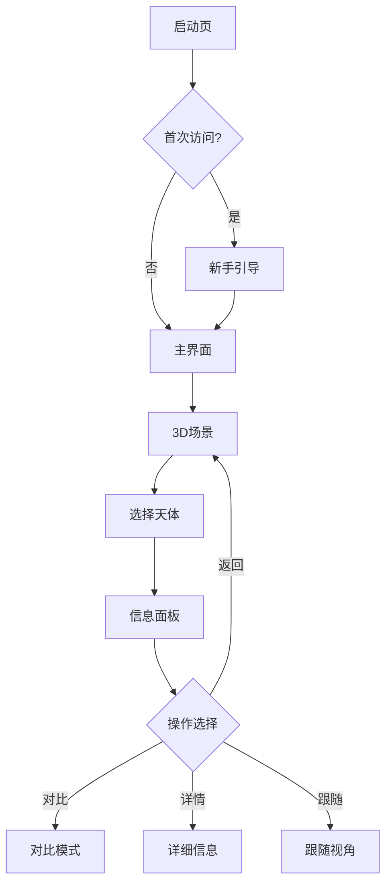

# 交互设计文档
## 太阳系3D模拟系统 - 用户体验设计规范

---

## 1. 设计理念

### 1.1 设计原则

#### 核心原则
- **直观性 (Intuitive)**: 无需学习即可上手
- **教育性 (Educational)**: 寓教于乐，知识传递
- **沉浸感 (Immersive)**: 身临其境的宇宙体验
- **响应性 (Responsive)**: 即时反馈，流畅交互
- **包容性 (Inclusive)**: 适配不同能力的用户

### 1.2 设计语言

```
视觉风格：现代科技 + 宇宙美学
色彩体系：深空蓝 + 星光白 + 行星彩
动效理念：物理真实 + 流畅自然
信息架构：渐进披露 + 层次分明
```

### 1.3 用户心智模型

```
用户期望行为模式：
探索 → 发现 → 学习 → 理解 → 分享
  ↓      ↓      ↓      ↓      ↓
自由浏览 选择天体 查看信息 对比分析 社交传播
```

## 2. 信息架构

### 2.1 整体架构图

```
太阳系3D模拟系统
├── 欢迎引导层
│   ├── 启动画面
│   ├── 新手教程
│   └── 快速开始
├── 主视图层
│   ├── 3D场景区
│   ├── 天体模型
│   └── 环境效果
├── 控制层
│   ├── 视角控制
│   ├── 时间控制
│   └── 设置选项
├── 信息层
│   ├── 天体信息
│   ├── 知识卡片
│   └── 数据对比
└── 辅助层
    ├── 搜索导航
    ├── 帮助系统
    └── 分享功能
```

### 2.2 页面流程图



### 2.3 导航结构

```
主导航
├── 快速访问
│   ├── 太阳
│   ├── 内行星
│   ├── 外行星
│   └── 矮行星
├── 功能菜单
│   ├── 搜索
│   ├── 比较
│   ├── 测量
│   └── 设置
└── 辅助功能
    ├── 帮助
    ├── 关于
    └── 分享
```

## 3. 界面布局设计

### 3.1 桌面端布局

```
┌─────────────────────────────────────────────────────┐
│  [☰] 太阳系3D模拟器        [搜索]    [设置] [帮助]   │ 64px
├───────┬─────────────────────────────────────────────┤
│       │                                             │
│  侧   │              3D 渲染区域                    │
│  边   │                                             │
│  栏   │         ┌──────────────┐                   │
│ 280px │         │   信息浮窗    │                   │
│       │         └──────────────┘                   │
│       │                                             │
├───────┴─────────────────────────────────────────────┤
│  ◀ ⏸ ▶  时间: 2025-01-08  速度: [1x][10x][100x]    │ 80px
└─────────────────────────────────────────────────────┘
```

### 3.2 移动端布局

```
┌─────────────────────┐
│   太阳系3D模拟器    │ 56px
├─────────────────────┤
│                     │
│                     │
│    3D 渲染区域      │
│                     │
│                     │
├─────────────────────┤
│  ┌─────────────┐   │
│  │  信息卡片    │   │ 可上滑
│  └─────────────┘   │
├─────────────────────┤
│ [主页][搜索][设置]  │ 56px
└─────────────────────┘
```

### 3.3 响应式断点

| 断点 | 设备类型 | 布局策略 | 关键调整 |
|------|---------|---------|---------|
| <480px | 手机竖屏 | 单栏堆叠 | 底部导航，全屏3D |
| 480-768px | 手机横屏/小平板 | 浮动面板 | 侧边抽屉，紧凑控件 |
| 768-1024px | 平板 | 双栏布局 | 可收缩侧栏 |
| 1024-1440px | 小屏桌面 | 三栏布局 | 完整功能展示 |
| >1440px | 大屏桌面 | 自适应扩展 | 更多信息密度 |

## 4. 交互设计规范

### 4.1 手势与操作映射

#### 鼠标操作

| 操作 | 功能 | 视觉反馈 | 响应时间 |
|------|------|---------|---------|
| **左键拖拽** | 旋转视角 | 惯性滚动 | <16ms |
| **右键拖拽** | 平移视图 | 网格参考 | <16ms |
| **滚轮滚动** | 缩放远近 | 平滑过渡 | <16ms |
| **左键单击** | 选择天体 | 高亮边框 | <100ms |
| **左键双击** | 聚焦天体 | 镜头动画 | 800ms |
| **悬停** | 预览信息 | 工具提示 | 500ms延迟 |

#### 触控操作

```
单指操作：
╔═══════════╗
║     ↑     ║  单指拖动 = 旋转视角
║   ←─┼─→   ║  
║     ↓     ║  响应：实时跟随
╚═══════════╝  灵敏度：1:1映射

双指操作：
╔═══════════╗
║   ←◉ ◉→   ║  捏合 = 缩放
║           ║  张开 = 放大
╚═══════════╝  缩放范围：0.1x-100x

三指操作：
╔═══════════╗
║  ◉ ◉ ◉    ║  三指拖动 = 平移
║    ←→     ║  
╚═══════════╝  边界：场景范围内
```

#### 键盘快捷键

```
导航控制：
├── 方向键 (↑↓←→) ─── 旋转视角
├── +/- ──────────── 缩放视图
├── Space ────────── 播放/暂停
├── R ───────────── 重置视角
└── F ───────────── 全屏模式

选择控制：
├── Tab ─────────── 循环选择天体
├── Enter ────────── 确认/聚焦
├── Esc ─────────── 取消选择
└── 1-9 ─────────── 快速选择行星

时间控制：
├── [ ] ─────────── 减速/加速
├── < > ─────────── 后退/前进一天
└── Home/End ────── 跳转到今天/起始
```

### 4.2 视角系统设计

#### 相机模式

```typescript
interface CameraMode {
  free: {        // 自由模式
    position: Vector3;
    rotation: Euler;
    fov: number; // 视野范围
  };
  follow: {      // 跟随模式
    target: CelestialBody;
    distance: number;
    offset: Vector3;
  };
  preset: {      // 预设视角
    overview: ViewConfig;     // 全景视角
    innerPlanets: ViewConfig; // 内行星视角
    outerPlanets: ViewConfig; // 外行星视角
    topDown: ViewConfig;      // 俯视视角
  };
  cinematic: {   // 电影模式
    path: CameraPath[];
    duration: number;
    easing: EasingFunction;
  };
}
```

#### 视角切换动画

```css
/* 过渡动画配置 */
.camera-transition {
  /* 近距离切换 */
  --short-duration: 500ms;
  --short-easing: cubic-bezier(0.4, 0, 0.2, 1);
  
  /* 中距离切换 */
  --medium-duration: 800ms;
  --medium-easing: cubic-bezier(0.4, 0, 0.6, 1);
  
  /* 远距离切换 */
  --long-duration: 1200ms;
  --long-easing: cubic-bezier(0.0, 0, 0.2, 1);
}
```

### 4.3 选择与高亮系统

#### 选择状态

```
未选中状态：
┌─────────┐
│ 普通渲染 │
└─────────┘

悬停状态：
┌─────────┐
│ 轮廓发光 │ ← 光晕效果
└─────────┘ ← 信息提示

选中状态：
╔═════════╗
║ 高亮边框 ║ ← 脉动动画
╚═════════╝ ← 信息面板

聚焦状态：
╔═════════╗
║ ◉ 居中  ║ ← 相机锁定
╚═════════╝ ← 详细信息
```

#### 多选模式

```typescript
// 多选交互逻辑
interface MultiSelectState {
  mode: 'single' | 'multiple' | 'compare';
  selected: Set<string>;
  maxSelection: number;
  
  onSelect: (id: string) => {
    if (mode === 'single') {
      selected.clear();
      selected.add(id);
    } else if (selected.size < maxSelection) {
      selected.add(id);
    }
  };
}
```

## 5. 动效设计

### 5.1 动效原则

```
动效层级：
Level 1 - 功能性动效（必需）
  └── 状态转换、加载指示
Level 2 - 增强性动效（推荐）
  └── 微交互、视觉反馈
Level 3 - 装饰性动效（可选）
  └── 背景动画、氛围效果
```

### 5.2 核心动效定义

#### 加载动画

```css
@keyframes planet-loading {
  0% {
    opacity: 0;
    transform: scale(0.8) rotate(0deg);
  }
  50% {
    opacity: 0.5;
    transform: scale(1.1) rotate(180deg);
  }
  100% {
    opacity: 1;
    transform: scale(1) rotate(360deg);
  }
}

.planet-enter {
  animation: planet-loading 1.5s ease-out;
}
```

#### 轨道动画

```javascript
// 轨道运动插值
function interpolateOrbit(t, duration, easing) {
  const progress = easing(t / duration);
  const angle = progress * 2 * Math.PI;
  
  return {
    x: Math.cos(angle) * radius,
    y: 0,
    z: Math.sin(angle) * radius,
    rotation: angle * rotationSpeed
  };
}
```

#### 选择反馈

```css
.selection-feedback {
  /* 选中脉动 */
  animation: pulse 2s infinite;
}

@keyframes pulse {
  0%, 100% {
    box-shadow: 0 0 20px rgba(100, 200, 255, 0.4);
  }
  50% {
    box-shadow: 0 0 40px rgba(100, 200, 255, 0.8);
  }
}
```

### 5.3 过渡时序

| 动效类型 | 持续时间 | 缓动函数 | 延迟 |
|---------|---------|---------|------|
| 微交互 | 150-300ms | ease-out | 0ms |
| 状态切换 | 300-500ms | ease-in-out | 0ms |
| 页面转场 | 500-800ms | ease-in-out | 100ms |
| 复杂动画 | 800-1500ms | custom-bezier | 适当延迟 |

## 6. 视觉设计规范

### 6.1 色彩系统

```scss
// 主色调
$primary-colors: (
  'space-dark': #0A0E27,    // 深空背景
  'space-blue': #1B2951,    // 空间蓝
  'star-white': #F8F9FA,    // 星光白
  'sun-yellow': #FFD700,    // 太阳黄
);

// 行星配色
$planet-colors: (
  'mercury': #8C8C8C,
  'venus': #FFC649,
  'earth': #4A90E2,
  'mars': #CD5C5C,
  'jupiter': #DAA520,
  'saturn': #F4E7D7,
  'uranus': #4FD0E0,
  'neptune': #4B70DD,
  'pluto': #9CA4AB,
);

// 功能色
$functional-colors: (
  'success': #52C41A,
  'warning': #FAAD14,
  'error': #F5222D,
  'info': #1890FF,
);

// 语义化颜色
$semantic-colors: (
  'text-primary': rgba(255, 255, 255, 0.95),
  'text-secondary': rgba(255, 255, 255, 0.65),
  'text-disabled': rgba(255, 255, 255, 0.35),
  'border': rgba(255, 255, 255, 0.15),
  'background': rgba(10, 14, 39, 0.95),
);
```

### 6.2 字体系统

```css
/* 字体栈 */
:root {
  --font-primary: 'SF Pro Display', 'PingFang SC', 'Microsoft YaHei', sans-serif;
  --font-mono: 'SF Mono', 'Monaco', 'Consolas', monospace;
  
  /* 字体大小 */
  --text-xs: 12px;
  --text-sm: 14px;
  --text-base: 16px;
  --text-lg: 18px;
  --text-xl: 20px;
  --text-2xl: 24px;
  --text-3xl: 30px;
  --text-4xl: 36px;
  
  /* 行高 */
  --leading-tight: 1.25;
  --leading-normal: 1.5;
  --leading-relaxed: 1.75;
  
  /* 字重 */
  --font-light: 300;
  --font-regular: 400;
  --font-medium: 500;
  --font-semibold: 600;
  --font-bold: 700;
}
```

### 6.3 间距系统

```scss
// 间距规范 (8px基准)
$spacing: (
  0: 0,
  1: 4px,
  2: 8px,
  3: 12px,
  4: 16px,
  5: 20px,
  6: 24px,
  8: 32px,
  10: 40px,
  12: 48px,
  16: 64px,
  20: 80px,
);

// 组件间距
.component-spacing {
  padding: map-get($spacing, 4);
  margin-bottom: map-get($spacing, 3);
  gap: map-get($spacing, 2);
}
```

### 6.4 图标系统

```typescript
// 图标规格
interface IconSystem {
  sizes: {
    xs: 16,  // 小图标
    sm: 20,  // 标准图标
    md: 24,  // 中等图标
    lg: 32,  // 大图标
    xl: 48,  // 特大图标
  };
  styles: {
    outlined: boolean;
    filled: boolean;
    twoTone: boolean;
  };
  animation: {
    rotate: boolean;
    pulse: boolean;
    bounce: boolean;
  };
}
```

## 7. 组件设计规范

### 7.1 信息面板组件

```
╔════════════════════════════════╗
║  ◉ 地球 Earth        [×]       ║ ← 标题栏
╠════════════════════════════════╣
║  ┌──────────┐                  ║
║  │  [图片]  │  直径: 12,742 km ║ ← 概览区
║  └──────────┘  质量: 5.97×10²⁴ ║
╠════════════════════════════════╣
║  [概览] [参数] [历史] [探索]    ║ ← 标签页
╠════════════════════════════════╣
║  详细内容区域...                ║ ← 内容区
║                                ║
╠════════════════════════════════╣
║  [对比] [跟随] [详情]          ║ ← 操作栏
╚════════════════════════════════╝
```

### 7.2 时间控制组件

```
╔═══════════════════════════════════════╗
║  ◀  ⏸  ▶   2025-01-08 12:00:00 UTC  ║
╠═══════════════════════════════════════╣
║  速度: [1×] [10×] [100×] [1000×]      ║
║  ─────●───────────────────────────    ║
║  00:00                      23:59     ║
╚═══════════════════════════════════════╝
```

### 7.3 搜索组件

```
╔═══════════════════════════════════╗
║  🔍 搜索天体...              [×]  ║
╠═══════════════════════════════════╣
║  快速访问                          ║
║  ├── ☉ 太阳                      ║
║  ├── 🌍 地球                      ║
║  └── 🌙 月球                      ║
║                                   ║
║  搜索结果                         ║
║  ├── 火星 Mars                    ║
║  ├── 火卫一 Phobos                ║
║  └── 火卫二 Deimos                ║
╚═══════════════════════════════════╝
```

### 7.4 设置面板

```
╔════════════════════════════════════╗
║  ⚙️ 设置                    [×]   ║
╠════════════════════════════════════╣
║  显示选项                          ║
║  ☑ 显示轨道线                     ║
║  ☑ 显示标签                       ║
║  ☑ 显示网格                       ║
║                                    ║
║  画质设置                          ║
║  ○ 低  ○ 中  ● 高  ○ 自动        ║
║                                    ║
║  音效                              ║
║  ───────●────── 70%               ║
║                                    ║
║  语言  [中文 ▼]                   ║
╚════════════════════════════════════╝
```

## 8. 响应式设计

### 8.1 自适应策略

```javascript
// 响应式配置
const responsiveConfig = {
  breakpoints: {
    xs: 0,     // 手机竖屏
    sm: 480,   // 手机横屏
    md: 768,   // 平板
    lg: 1024,  // 桌面
    xl: 1440,  // 大屏
    xxl: 1920  // 超大屏
  },
  
  layouts: {
    xs: {
      sidebar: 'hidden',
      controls: 'bottom',
      infoPanel: 'sheet'
    },
    md: {
      sidebar: 'collapsible',
      controls: 'bottom',
      infoPanel: 'floating'
    },
    lg: {
      sidebar: 'visible',
      controls: 'integrated',
      infoPanel: 'docked'
    }
  }
};
```

### 8.2 触控优化

```css
/* 触控目标大小 */
.touch-target {
  min-width: 44px;
  min-height: 44px;
  padding: 12px;
}

/* 触控反馈 */
.touch-feedback {
  -webkit-tap-highlight-color: rgba(100, 200, 255, 0.3);
  touch-action: manipulation;
}

/* 防止误触 */
.touch-safe-area {
  padding: env(safe-area-inset-top) 
           env(safe-area-inset-right) 
           env(safe-area-inset-bottom) 
           env(safe-area-inset-left);
}
```

## 9. 无障碍设计

### 9.1 ARIA标注

```html
<!-- 主要区域标注 -->
<main role="main" aria-label="太阳系3D场景">
  <canvas 
    role="img" 
    aria-label="太阳系3D视图"
    tabindex="0"
    aria-describedby="scene-description">
  </canvas>
  <div id="scene-description" class="sr-only">
    当前显示太阳系全景，包含太阳和9大行星
  </div>
</main>

<!-- 控件标注 -->
<button 
  aria-label="选择地球"
  aria-pressed="false"
  aria-describedby="earth-info">
  <span aria-hidden="true">🌍</span>
  地球
</button>

<!-- 状态通知 -->
<div role="status" aria-live="polite" aria-atomic="true">
  已选择地球，按Enter键查看详情
</div>
```

### 9.2 键盘导航

```javascript
// 键盘导航管理
class KeyboardNavigator {
  private focusableElements: Element[];
  private currentIndex: number = 0;
  
  handleKeyDown(event: KeyboardEvent) {
    switch(event.key) {
      case 'Tab':
        event.shiftKey ? this.focusPrevious() : this.focusNext();
        break;
      case 'Enter':
      case ' ':
        this.activateCurrent();
        break;
      case 'Escape':
        this.exitFocus();
        break;
      case 'ArrowLeft':
      case 'ArrowRight':
      case 'ArrowUp':
      case 'ArrowDown':
        this.navigateScene(event.key);
        break;
    }
  }
  
  // 焦点管理
  focusNext() {
    this.currentIndex = (this.currentIndex + 1) % this.focusableElements.length;
    this.focusableElements[this.currentIndex].focus();
  }
}
```

### 9.3 视觉辅助

```css
/* 高对比模式 */
@media (prefers-contrast: high) {
  :root {
    --text-primary: #FFFFFF;
    --background: #000000;
    --border-width: 2px;
  }
}

/* 减少动画 */
@media (prefers-reduced-motion: reduce) {
  * {
    animation-duration: 0.01ms !important;
    animation-iteration-count: 1 !important;
    transition-duration: 0.01ms !important;
  }
}

/* 焦点指示器 */
:focus-visible {
  outline: 3px solid #4A90E2;
  outline-offset: 2px;
}
```

## 10. 错误处理与反馈

### 10.1 错误状态设计

```
加载失败：
╔════════════════════════════╗
║       ⚠️ 加载失败          ║
║                            ║
║   无法加载3D场景           ║
║   请检查网络连接           ║
║                            ║
║   [重试]  [离线模式]       ║
╚════════════════════════════╝

WebGL不支持：
╔════════════════════════════╗
║     🚫 浏览器不支持        ║
║                            ║
║  您的浏览器不支持WebGL     ║
║  建议使用Chrome或Firefox   ║
║                            ║
║  [下载Chrome] [了解更多]   ║
╚════════════════════════════╝
```

### 10.2 加载状态

```typescript
// 加载状态管理
interface LoadingState {
  stage: 'init' | 'assets' | 'scene' | 'complete';
  progress: number; // 0-100
  message: string;
  
  render: () => JSX.Element;
}

// 加载界面组件
const LoadingScreen = ({ stage, progress, message }) => (
  <div className="loading-screen">
    <div className="solar-system-loader">
      <div className="sun"></div>
      <div className="planet-orbit">
        <div className="planet"></div>
      </div>
    </div>
    <div className="loading-progress">
      <div className="progress-bar" style={{ width: `${progress}%` }} />
    </div>
    <div className="loading-message">{message}</div>
  </div>
);
```

### 10.3 用户反馈机制

```
操作反馈类型：
├── 即时反馈 (0-100ms)
│   ├── 悬停效果
│   ├── 点击波纹
│   └── 焦点高亮
├── 短期反馈 (100-1000ms)
│   ├── 加载动画
│   ├── 过渡效果
│   └── 提示信息
└── 长期反馈 (>1000ms)
    ├── 进度指示
    ├── 状态更新
    └── 完成通知
```

## 11. 性能优化指南

### 11.1 渲染优化

```javascript
// 分层渲染策略
class LayeredRenderer {
  layers = {
    background: { fps: 1 },    // 背景层：低频更新
    planets: { fps: 30 },      // 行星层：中频更新
    ui: { fps: 60 },          // UI层：高频更新
    effects: { fps: 15 }      // 特效层：按需更新
  };
  
  render(timestamp) {
    for (const [layer, config] of Object.entries(this.layers)) {
      if (this.shouldUpdate(layer, timestamp, config.fps)) {
        this.renderLayer(layer);
      }
    }
  }
}
```

### 11.2 交互优化

```javascript
// 交互节流和防抖
const interactionOptimizer = {
  // 节流：限制频率
  throttle: (func, limit) => {
    let inThrottle;
    return function() {
      const args = arguments;
      const context = this;
      if (!inThrottle) {
        func.apply(context, args);
        inThrottle = true;
        setTimeout(() => inThrottle = false, limit);
      }
    }
  },
  
  // 防抖：延迟执行
  debounce: (func, delay) => {
    let timeoutId;
    return function() {
      const args = arguments;
      const context = this;
      clearTimeout(timeoutId);
      timeoutId = setTimeout(() => func.apply(context, args), delay);
    }
  }
};

// 应用优化
const optimizedHandlers = {
  onMouseMove: interactionOptimizer.throttle(handleMouseMove, 16),
  onScroll: interactionOptimizer.throttle(handleScroll, 100),
  onResize: interactionOptimizer.debounce(handleResize, 300),
  onSearch: interactionOptimizer.debounce(handleSearch, 500)
};
```

## 12. 设计系统集成

### 12.1 组件库结构

```typescript
// 设计系统组件导出
export const DesignSystem = {
  // 基础组件
  atoms: {
    Button,
    Icon,
    Text,
    Input,
    Slider
  },
  
  // 复合组件
  molecules: {
    Card,
    Modal,
    Tooltip,
    Dropdown,
    TabBar
  },
  
  // 业务组件
  organisms: {
    InfoPanel,
    TimeControl,
    SearchBar,
    SettingsPanel,
    NavigationMenu
  },
  
  // 页面模板
  templates: {
    MainLayout,
    LoadingScreen,
    ErrorBoundary
  },
  
  // 主题系统
  theme: {
    colors,
    typography,
    spacing,
    animations
  }
};
```

### 12.2 设计令牌

```json
{
  "design-tokens": {
    "color": {
      "primary": "#1B2951",
      "secondary": "#4A90E2",
      "background": "#0A0E27",
      "surface": "#1A1E3A",
      "text": {
        "primary": "#F8F9FA",
        "secondary": "#A8B2C7",
        "disabled": "#5A6478"
      }
    },
    "spacing": {
      "unit": 8,
      "xs": 4,
      "sm": 8,
      "md": 16,
      "lg": 24,
      "xl": 32,
      "xxl": 48
    },
    "radius": {
      "sm": 4,
      "md": 8,
      "lg": 12,
      "full": 9999
    },
    "shadow": {
      "sm": "0 2px 4px rgba(0,0,0,0.1)",
      "md": "0 4px 8px rgba(0,0,0,0.15)",
      "lg": "0 8px 16px rgba(0,0,0,0.2)",
      "xl": "0 16px 32px rgba(0,0,0,0.25)"
    },
    "animation": {
      "fast": "150ms",
      "normal": "300ms",
      "slow": "500ms",
      "verySlow": "1000ms"
    }
  }
}
```

## 13. 原型与线框图

### 13.1 交互流程原型

```
用户旅程地图：
START → 加载页面 → 场景初始化 → 探索模式
            ↓
      [新手引导可选]
            ↓
      自由浏览太阳系
      ├── 选择天体 → 查看信息 → 深入了解
      ├── 比较模式 → 选择多个 → 对比分析
      ├── 时间控制 → 观察运动 → 理解规律
      └── 搜索功能 → 快速定位 → 精确查找
```

### 13.2 移动端手势图

```
┌─────────────┐     ┌─────────────┐
│   单指滑动   │     │   双指缩放   │
│      ↕       │     │    ◀─▶      │
│  旋转视角    │     │   放大缩小   │
└─────────────┘     └─────────────┘

┌─────────────┐     ┌─────────────┐
│   三指拖动   │     │    长按      │
│    ← →      │     │      ◉       │
│   平移视图   │     │   选择天体   │
└─────────────┘     └─────────────┘
```

## 14. 设计验证与测试

### 14.1 可用性测试计划

| 测试项目 | 测试方法 | 成功标准 | 优先级 |
|---------|---------|---------|--------|
| 首次使用 | 观察法 | 5分钟内掌握 | P0 |
| 任务完成 | 任务测试 | 完成率>90% | P0 |
| 满意度 | 问卷调查 | 评分>4.0/5 | P1 |
| 错误率 | 数据分析 | 错误<5% | P1 |
| 学习曲线 | 追踪测试 | 递减趋势 | P2 |

### 14.2 A/B测试方案

```javascript
// A/B测试配置
const abTestVariants = {
  'navigation-style': {
    A: 'sidebar',     // 侧边栏导航
    B: 'bottom-bar'   // 底部导航栏
  },
  'info-display': {
    A: 'modal',       // 模态框
    B: 'panel'        // 侧滑面板
  },
  'onboarding': {
    A: 'guided-tour', // 引导教程
    B: 'video-intro'  // 视频介绍
  }
};

// 指标收集
const metrics = {
  engagement: ['session_duration', 'interactions_count'],
  completion: ['task_success_rate', 'time_to_complete'],
  satisfaction: ['nps_score', 'feature_usage']
};
```

## 15. 设计交付规范

### 15.1 设计文件组织

```
design-assets/
├── mockups/          # 视觉稿
│   ├── desktop/
│   ├── mobile/
│   └── tablet/
├── prototypes/       # 原型文件
│   ├── figma/
│   └── principle/
├── components/       # 组件规范
│   ├── atoms/
│   ├── molecules/
│   └── organisms/
├── icons/           # 图标资源
│   ├── svg/
│   └── font/
├── animations/      # 动效规范
│   └── lottie/
└── guidelines/      # 设计指南
    ├── brand/
    └── patterns/
```

### 15.2 开发交接清单

- [ ] 设计稿标注完整
- [ ] 切图资源导出
- [ ] 交互说明文档
- [ ] 动效参数说明
- [ ] 响应式断点规范
- [ ] 组件状态说明
- [ ] 异常情况处理
- [ ] 无障碍要求
- [ ] 性能指标要求
- [ ] 验收标准文档

---

**文档版本**

| 版本 | 日期 | 设计师 | 审核人 | 更新内容 |
|------|------|--------|--------|----------|
| v1.0 | 2025-01-08 | UX Designer | Product Manager | 初始版本 |